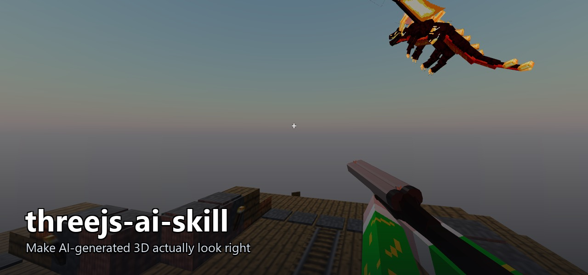
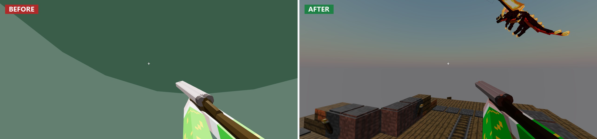

<p align="center">
  
</p>

<h1 align="center">threejs-ai-skill</h1>

<p align="center"><strong>Make AI-generated 3D actually look right.</strong></p>

<p align="center">
  
  
  
</p>

---

You ask your AI for a 3D scene. The code runs on the first try. Then you actually look at it: models load at the **wrong scale**, **facing the wrong way**, **floating or clipping through the floor**, the camera aimed at nothing, everything lit flat. It *compiled* — it just looks broken.

**Words are a lossy interface for 3D space.** Your AI can't see the scene — it guesses scale, orientation, and placement from text, and guesses wrong. `threejs-ai-skill` is a portable ruleset that hands it the spatial rules it's missing, so the Three.js / WebGL / react-three-fiber code it generates actually looks and works right — no matter where the models come from.

## The difference

<p align="center">
  
</p>

Same request, same models. The difference is whether the AI reasoned about the physical rules of a real 3D world — or just emitted code that runs.

## What it covers (layered)

| Layer | Fixes |
|---|---|
| **Scene sanity** | Model scale/orientation, framed camera, coherent lighting, renderer/resize setup |
| **World coherence** | No infinite spawns, relative scale, everything on the ground, intentional layout |
| **Collisions** | Objects that don't pass through everything; when to reach for a physics engine |
| **Input & controls** | deltaTime, normalized diagonals, multi-key, clamped mouse-look, camera-relative movement |
| **Locomotion** ⚠️ | Characters that walk without sliding or floating |
| **Animation handling** ⚠️ | Play clips, retarget, and procedural motion for models with no animation |

⚠️ = verify visually; these are the hard ones.

## Install

It's plain markdown, not tied to any vendor. Clone it, then wire it into whichever AI assistant you use:

```bash
git clone https://github.com/luisnavarrete12/threejs-ai-skill
```

| Assistant | How |
|---|---|
| **Claude Code** | `cp -r threejs-ai-skill ~/.claude/skills/` — auto-loads on 3D tasks |
| **Cursor** | Reference `SKILL.md` from `.cursor/rules/` (or your `.cursorrules`) |
| **GitHub Copilot** | Point `.github/copilot-instructions.md` at `SKILL.md`, or paste it in |
| **Gemini CLI / others** | Point `GEMINI.md` at these files, or attach `SKILL.md` to context when you start 3D work |

`SKILL.md` is the entry point — a lightweight index. The heavier layers in `references/` load only when the task needs them.

## Status

Core layers (scene sanity, world coherence, collisions, input) are stable. Locomotion and animation-handling — especially procedural motion — should be validated on real output before you rely on them.

## License

[MIT](LICENSE) — use it, fork it, PRs welcome. ⭐ it if it saved you a debugging session.
